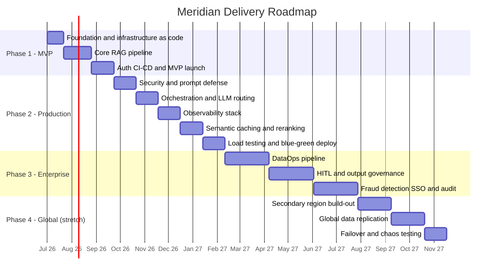

# Meridian — Delivery Plan
### Enterprise Multi-Region RAG Platform

| | |
|---|---|
| **Status** | Draft v1.0 — active |
| **Owner** | Mahmoud Heshmat |
| **Last updated** | 2026-06-12 |
| **Companion docs** | [README.md](./README.md) for product overview · `docs/adr/` for architecture decisions |

> *"Meridian" is a working title for the platform — rename freely throughout this document and the README if you choose something else.*

---

## 1. Executive summary

This document is the execution plan for building Meridian, the multi-region RAG platform described in the architecture documentation, as a real, deployable, production-grade system rather than a diagram. It is written as a living plan: every sprint ends with an update to the change log in Section 14, and every major decision gets its own ADR in `docs/adr/`.

The plan is organized into four phases that mirror the architecture's natural maturity curve — MVP, Production Hardening, Enterprise Scale, and Global Multi-Region. Phases 1 and 2 together constitute the "production-ready" core: a single-region system with automated deployment, security baselines, observability, and documented SLOs. Phases 3 and 4 layer on the enterprise governance and global DR capabilities that turn the core into the full architecture.

The plan assumes a solo developer working part-time, with AI-assisted development (Claude / Copilot) used deliberately to accelerate boilerplate so that design, testing, and documentation — the parts that actually demonstrate seniority — get the time they need.

### 1.1 What "production-ready" means for this project

A phase is not considered production-ready just because the code runs. The bar is: all infrastructure is defined in Terraform and reproducible from a clean account; every service has automated tests and a CI pipeline that blocks merges on failure; every deployment is observable (metrics, traces, logs) and reversible (blue-green with automatic rollback); every security control (auth, WAF, secrets management, audit trail) is active, not theoretical; and every SLO in Section 2.2 has a dashboard showing the current value against the target.

---

## 2. Objectives and success criteria

### 2.1 Portfolio objectives

The project exists to produce evidence — not claims — of senior-level AI infrastructure, MLOps, and data engineering capability. Each phase should yield artifacts that stand on their own in interviews and on GitHub: working deployments, load-test reports, dashboards, runbooks, and ADRs that show *how* and *why* decisions were made, including the ones that were later reversed.

### 2.2 Engineering objectives — service level targets

| Metric | Phase 1 target | Phase 2+ target | Phase 4 target |
|---|---|---|---|
| p99 latency, cache miss | < 5s (functional) | < 2s | < 2s |
| p99 latency, cache hit | n/a | < 100ms | < 100ms |
| Availability | best-effort | 99.5% | 99.99% |
| RTO (region failure) | n/a | n/a | 2–5 min |
| RPO (region failure) | n/a | n/a | < 1s |
| Semantic cache hit rate | n/a | ≥ 15% | ≥ 15% |
| Hallucination rate (NLI-flagged) | measured, no gate | < 8% | < 5% |
| CI pipeline | lint + unit tests | + integration + load tests | + chaos tests |

---

## 3. Delivery methodology

Work is organized into two-week sprints tracked on a GitHub Projects board with three columns: Backlog, In Progress, Done. Each sprint begins with a short planning note (what, why, exit criteria) committed to `docs/sprints/` and ends with a retro note covering what shipped, what slipped, and what was learned — the retro notes become the raw material for the portfolio case study referenced in Section 9.3.

Two conventions apply throughout: commits follow Conventional Commits (`feat:`, `fix:`, `docs:`, `infra:`) so the changelog can be partially generated, and every Terraform module is applied to a `dev` workspace before being promoted to `staging`. There is no `prod` environment until Phase 2, by design — Phase 1's goal is a working dev deployment, not a public launch.

A one-week buffer is scheduled after every three sprints (Section 13) to absorb slippage, refactor accumulated shortcuts, and catch up on documentation. Buffers are not used for new features.

---

## 4. Roadmap at a glance

Phases 1–2 (≈8 months) deliver the production-ready core. Phase 3 (≈6 months) adds enterprise governance. Phase 4 (≈4 months) is the global multi-region stretch goal — valuable for demonstrating DR design, but the project is a credible, deployable product without it.

---

## 5. Phase 1 — MVP (Sprints 1–6, ~Months 1–3)

Goal: a single-region RAG system, deployed via Terraform, that answers a query end-to-end with cited sources.

| Sprint | Weeks | Focus | Key deliverables | Exit criteria |
|---|---|---|---|---|
| 1 | 1–2 | Project foundation | Repo scaffolding per README structure; Terraform remote state (S3 + DynamoDB lock); base VPC module (public/private subnets, NAT); local Docker dev environment skeleton | `terraform apply` provisions a VPC in a fresh dev account; `docker-compose up` starts a placeholder FastAPI service |
| 2 | 3–4 | Data layer | Aurora PostgreSQL + pgvector Terraform module; Alembic migrations for `documents` / `document_chunks`; ElastiCache Redis module (single node, dev) | Aurora reachable from ECS subnet; pgvector extension enabled; migrations run automatically in CI |
| 3 | 5–6 | Embedding pipeline v1 | Local ingestion script: file → chunk → Bedrock Titan Embeddings → pgvector upsert; `/v1/documents` endpoint | Uploading a sample document produces rows with embeddings; a manual ANN query returns relevant chunks |
| 4 | 7–8 | Core RAG endpoint | `/v1/chat` — vector search → prompt assembly → Bedrock Claude invocation → response with citations; conversation history in DynamoDB | A test query returns a grounded answer citing the correct source chunk; latency is logged |
| 5 | 9–10 | Auth and CI | Cognito user pool + API Gateway JWT authorizer in front of ECS via ALB; ECR repository; GitHub Actions CI (lint, unit tests, Docker build and push) | Unauthenticated requests are rejected; CI is green on every push to `main`; image lands in ECR |
| 6 | 11–12 | MVP deployment and demo | Full Terraform apply to a dev AWS environment; CloudWatch basic dashboards; smoke test suite; recorded demo walkthrough; Phase 2 backlog grooming | MVP is reachable end-to-end in AWS (VPN-gated is fine); demo video linked from README; Phase 2 backlog refined |

---

## 6. Phase 2 — Production hardening (Sprints 7–16, ~Months 4–8)

Goal: the system meets its SLOs under load, is observable, and can be deployed without downtime.

| Sprints | Workstream | Key deliverables | Exit criteria |
|---|---|---|---|
| 7–8 | Security and prompt defense | AWS WAF (OWASP managed rules, IP rate limiting, geo rules) in front of API Gateway; Lambda prompt-injection validator (pattern + embedding-similarity classifier); blocked-request audit trail via DynamoDB Streams → S3 Object Lock (see ADR-003, Section 6 note) | A documented test set of 20 known prompt-injection patterns is blocked at ≥90%; WAF metrics visible in CloudWatch |
| 9–10 | Orchestration and LLM routing | Step Functions Express workflow replaces the direct Lambda chain; query-complexity classifier routes between Haiku / Sonnet; vLLM container on Fargate for one open model as a routing option; circuit breaker for Bedrock → Azure OpenAI fallback | Step Functions executes the full flow with parallel branches; router demonstrably picks a cheaper model for simple queries, with the cost delta logged |
| 11–12 | Observability stack | Prometheus + Grafana on ECS; OpenTelemetry instrumentation in FastAPI; X-Ray end-to-end tracing; nightly RAGAS evaluation on a fixed eval set; cost-attribution table in DynamoDB | One Grafana dashboard shows latency, cache hit rate, RAGAS faithfulness score, and cost per 1k queries |
| 13–14 | Semantic caching and retrieval quality | Redis semantic cache (cosine similarity ≥ 0.95); hybrid search (pgvector cosine + `tsvector` BM25 with RRF fusion); cross-encoder reranker (bge-reranker on vLLM) for top-20 → top-5 | Semantic cache hit rate ≥ 15% on a repeated-query benchmark; retrieval NDCG@5 improves over the Sprint 4 baseline, documented |
| 15–16 | Load testing, SLOs and blue-green | k6/Locust load test against the p99 < 2s target; ECS blue-green deployment via CodeDeploy with deployment circuit breaker; canary stage in GitHub Actions; production-readiness review and retro | SLO document signed off; a real blue-green deployment is performed with zero downtime, evidenced by logs and dashboards |

> **Note on ADR-003 (QLDB replacement):** the original architecture used QLDB for the blocked-request audit ledger. QLDB has been deprecated for new customers since July 2024, so Sprint 7–8 implements the audit trail as DynamoDB Streams → Lambda → S3 with Object Lock from the start. Document this as ADR-003 in `docs/adr/` so the deviation from the original diagram is explained, not silent.

---

## 7. Phase 3 — Enterprise scale (Sprints 17–28, ~Months 9–14)

Goal: the platform supports continuous real-world data ingestion, human governance over risky outputs, and enterprise identity.

| Sprints | Workstream | Key deliverables | Exit criteria |
|---|---|---|---|
| 17–20 | DataOps pipeline | AWS Glue jobs (clean, dedupe, partition) against a real external source (e.g. arXiv API or SEC EDGAR); Kinesis Data Streams → embedding Lambda for real-time ingestion; Kinesis Firehose + ECS batch task for bulk re-embedding; Embedding Version Manager (blue/green pgvector tables) | A real external dataset is continuously ingested; new documents are searchable within 60s; one full blue-green embedding-model migration is completed end-to-end |
| 21–24 | HITL and output governance | NLI-based hallucination detector (`cross-encoder/nli-deberta-v3-large`) scoring every response; risk-scoring function driving routing; lightweight HITL console (React) backed by SQS + Step Functions `.waitForTaskToken`; S3 Object Lock archive for approved responses | Medium-risk responses provably pause for human review and resume on approval; hallucination rate is tracked on the Phase 2 dashboard; ≥ 50 real reviewed cases logged |
| 25–28 | Fraud detection, SSO and audit | Lightweight fraud-scoring service (rules + anomaly detection) running in parallel with cache lookup; Cognito SAML federation against a demo IdP; DynamoDB-Streams-based hash-chained audit ledger fully replacing the Phase 2 placeholder; AWS Comprehend PII detection before archival | SAML login succeeds against a demo IdP; audit ledger entries are independently verifiable as tamper-evident; synthetic PII test strings are detected and redacted before S3 archival |

---

## 8. Phase 4 — Global multi-region (Sprints 29–36, ~Months 15–18) — stretch

Goal: demonstrate the multi-region DR design with measured, not theoretical, RTO/RPO.

| Sprints | Workstream | Key deliverables | Exit criteria |
|---|---|---|---|
| 29–31 | Secondary region build-out | Terraform modules deployed unchanged into `eu-central-1` (passive); Global Accelerator; Route53 health-based routing | The `eu-central-1` stack deploys cleanly from the same modules used in `us-east-1`; health checks are green |
| 32–34 | Global data replication | Aurora Global Database (read replica in `eu-central-1`); DynamoDB Global Tables; Redis Global Datastore; S3 Cross-Region Replication | A write in `us-east-1` is observable in `eu-central-1` within the RPO target, with replication lag measured and logged |
| 35–36 | Failover drills and chaos testing | AWS Fault Injection Simulator scenarios: kill primary Aurora, kill primary ECS service, throttle Bedrock; finalized DR runbook | At least two full failover drills executed and documented with timestamps; runbook published in `docs/runbooks/` |

---

## 9. Cross-cutting workstreams

### 9.1 Certification roadmap alignment

Certifications are sequenced to reinforce the sprint work in progress, not as a separate track competing for the same hours.

| Certification | Target sprint window | Rationale |
|---|---|---|
| AWS SAA-C03 | Sprints 1–6 | Covers the core services used in the MVP — VPC, ECS, RDS, IAM |
| HashiCorp Terraform Associate | Sprints 3–8 | Overlaps with the heaviest Terraform-authoring period |
| AWS DVA-C02 | Sprints 9–16 | Deep dive on Lambda, API Gateway, DynamoDB — all central to Phase 2 |
| AWS MLS-C01 | Sprints 17–26 | Aligns with the DataOps and HITL work in Phase 3 |
| AWS SAP-C02 | Sprints 29–36 | Validates the multi-region DR design at the point it is implemented |
| Goethe B2 | Continuous | Independent of build sprints; protect a fixed weekly slot throughout, not tied to phase boundaries |

### 9.2 Testing strategy by phase

| Phase | Testing additions |
|---|---|
| 1 | Unit tests (pytest) for retrieval and prompt assembly; manual smoke tests against the deployed dev environment |
| 2 | Integration tests using testcontainers for Postgres/Redis; k6 load tests; nightly RAGAS evaluation as a CI gate |
| 3 | Contract tests for the HITL state machine; data-quality tests for Glue jobs (Great Expectations) |
| 4 | Fault-injection and chaos tests; cross-region consistency checks |

### 9.3 Documentation cadence

Every sprint updates `CHANGELOG.md`. Every major decision — including reversed ones, like the QLDB → DynamoDB Streams change in Section 6 — gets a numbered ADR in `docs/adr/`, following the lightweight Michael Nygard format (context, decision, consequences). At the end of the project, the sprint retro notes from Section 3 are synthesized into a single case-study document covering the problem, the key design decisions, what changed along the way and why, and the metrics actually achieved against the Section 2.2 targets — this case study is the primary artifact for interviews.

---

## 10. Milestones and gate reviews

| Milestone | Target date | Gate criteria |
|---|---|---|
| M0 — Kickoff | 2026-07-01 | Repository, AWS account, and Terraform backend ready |
| M1 — MVP demo | 2026-09-30 | End-to-end RAG query via a deployed API; demo video recorded and linked from README |
| M2 — Production launch | 2027-02-28 | SLOs from Section 2.2 met under load test; at least one zero-downtime blue-green deployment completed |
| M3 — Enterprise-ready | 2027-08-31 | HITL, DataOps ingestion, and the audit trail are operating on real (non-synthetic) data |
| M4 — Global DR validated | 2027-12-31 | A documented failover drill meets the Phase 4 RTO/RPO targets |

---

## 11. Risk register

| Risk | Likelihood | Impact | Mitigation |
|---|---|---|---|
| AWS costs exceed personal budget | Medium | High | Free Tier + Bedrock on-demand only through Phase 1–2; CloudWatch billing alarms at $50 / $150 / $300; non-prod environments torn down nightly via a scheduled `terraform destroy` |
| Scope creep delays the MVP | High | Medium | Phase 1 backlog is frozen after Sprint 1; new ideas go to a separate "Phase 2+ ideas" backlog rather than the active sprint |
| pgvector hits a performance ceiling early | Low at portfolio scale | Medium | Benchmark at 100k / 1M / 5M vectors to know the actual ceiling; document the Qdrant migration path as an ADR even if it is never executed |
| Solo-developer time conflicts (job search, German B2, coursework) | High | High | Sprint scope is capped, not stretched; a buffer week every three sprints absorbs slippage; velocity is tracked and the plan is re-cut rather than worked around |
| LLM provider model deprecations | Medium | Medium | Model versions are pinned in config; new model versions are smoke-tested on a branch before being promoted |
| QLDB-shaped design debt | Resolved | — | Mitigated from Sprint 7 via ADR-003 (DynamoDB Streams + S3 Object Lock) before any code depends on QLDB |

---

## 12. Definition of done

**Phase 1**
- [ ] All Terraform modules under `infrastructure/terraform/modules/{vpc,ecs,aurora,redis}` apply cleanly to a fresh AWS account
- [ ] `/v1/chat` returns a grounded, cited response for at least 20 test queries
- [ ] CI runs lint, unit tests, and a Docker build on every pull request
- [ ] Cognito-protected endpoints reject unauthenticated requests
- [ ] A fresh clone can complete the README "Getting started" steps in under 30 minutes
- [ ] A demo video is recorded and linked from the README

**Phase 2**
- [ ] A documented prompt-injection test set is blocked at ≥ 90% by WAF and the Lambda validator
- [ ] p99 latency is under 2s at target load, with the k6 report archived under `docs/load-tests/`
- [ ] A Grafana dashboard shows live latency, cache hit rate, cost, and RAGAS faithfulness
- [ ] At least one blue-green deployment to staging completes with zero downtime
- [ ] Semantic cache hit rate is ≥ 15% on the benchmark query set

**Phase 3**
- [ ] A real external data source has been ingested continuously via Kinesis for at least 7 days
- [ ] ≥ 50 HITL reviews are completed and logged
- [ ] Audit ledger entries are hash-chained and independently verifiable
- [ ] PII redaction is verified against a synthetic-PII test corpus

**Phase 4**
- [ ] The `eu-central-1` stack deploys from the same Terraform modules as `us-east-1`
- [ ] ≥ 2 failover drills are documented with measured RTO and RPO
- [ ] The DR runbook is published and reviewable in `docs/runbooks/`

---

## 13. Velocity and resourcing assumptions

This plan for a single developer working roughly 12–15 focused hours per week during academic terms and up to 30 hours per week during breaks, giving each two-week sprint a working budget of approximately 24–30 hours. AI-assisted development is used deliberately for boilerplate — Terraform module scaffolding, CRUD endpoints, test scaffolding — and the velocity figures above already assume that acceleration; the recovered time is intentionally reinvested in design, testing, and documentation rather than additional features. A one-week buffer after every three sprints (Section 3) exists to absorb the inevitable slippage without it cascading through the rest of the plan — if a buffer week goes unused, pull the next sprint forward rather than starting new work early.

---

## 14. Change log

| Date | Change |
|---|---|
| 2026-06-12 | Initial delivery plan created |
| 2026-7-16  | Blueprint & Basic terraform infrastructure  & File structure created |
